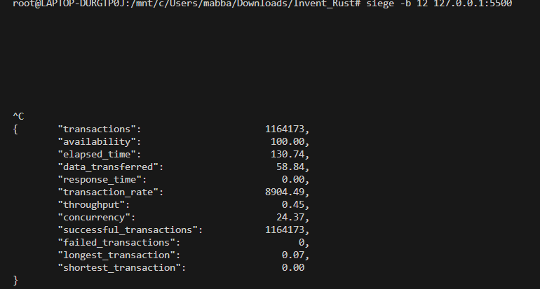

# Actix Web Server

This project is a simple web server built with Actix Web that serves static HTML files and provides basic routes.

## Installation

1. Ensure you have [Rust](https://www.rust-lang.org/tools/install) installed on your machine.
2. Clone this repository:

    ```sh
    git clone https://github.com/yourusername/actix-web-server.git
    ```

3. Navigate to the project directory:

    ```sh
    cd actix-web-server
    ```

4. Build the project:

    ```sh
    cargo build
    ```

## Usage

To run the server, use the following command:

```sh
cargo run
```

The server will start and listen on `http://localhost:8080`. You can access the following endpoints:

## Endpoints

- GET /: Returns a welcome message.
- GET /intro/{name}: Greets the user with the specified name.
- POST /echo: Echoes back the JSON payload.

## Static Files

The server serves the following static HTML files:

- `404.html`: Custom 404 error page.
- `hello.html`: A simple HTML file with a greeting message.

## Testing

To run the tests, use the following command:

```sh
cargo test
```

The tests cover the server routes and error handling.

## Siege Test Result 




## License

This project is licensed under the MIT License. See the [LICENSE](LICENSE) file for details.
